# ACM Portfolio 3 — Bayesian Models of Social Conformity

This project models how people update attractiveness ratings after seeing group feedback. Two Bayesian agents are implemented, PBA and WBA, fit to both simulated and empirical data in Stan, and compared using LOO-CV stacking weights.

---

## Repository Structure

```
ACM-3rd/
├── workbook.Rmd          # Main analysis — all code, models, plots
├── stan/
│   ├── PBA.stan          # Proportional Bayesian Agent Stan model
│   └── WBA.stan          # Weighted Bayesian Agent Stan model
├── data/
│   └── cogsci_clean.csv  # Empirical facial attractiveness rating data
├── model_recovery.rds    # Cached model recovery results (50 sims x 6 conditions)
└── plots/                # All saved figures (generated by final Rmd chunk)
```

---

## Setup and Reproduction

### Dependencies

```r
install.packages("pacman")
pacman::p_load(cmdstanr, tidyverse, cowplot, posterior, ggh4x, ggpmisc, tidybayes, bayesplot)
```

You also need Stan itself:

```r
cmdstanr::install_cmdstan()
```

### Running the analysis

Open `workbook.Rmd` in RStudio and run all chunks in order. Here is what each stage does:

1. **Setup** - loads packages, sets theme
2. **Agent definitions** - defines `agent.PBA()` and `agent.WBA()`
3. **Scenario simulation** - 100 observations across 3 scenarios per model
4. **Model recovery** - 50 simulations per condition, cached to `model_recovery.rds`. Set `regenerate_simulations <- TRUE` to rerun from scratch (takes 1-2 hours)
5. **Sampling diagnostics** - trace plots and divergence checks on the last recovery fit
6. **Empirical fitting** - fits both models to 5 participants from `cogsci_clean.csv`
7. **Predictive checks and prior-posterior updates** - on the empirical fits
8. **Save plots** - writes all figures to `plots/`

`model_recovery.rds` is already in the repo, so you can skip step 4 unless you want to regenerate it.

---

## The Task

Participants rate faces on a 1-8 attractiveness scale (FirstRating). They then see a group average (GroupRating) and rate again (SecondRating). The measure of interest is how much they shift: Change = SecondRating - FirstRating, as a function of Feedback = GroupRating - FirstRating. A positive correlation between these two means the participant moved toward the group. That is social conformity.

---

## The Models

Both models use the same core structure: the second rating is drawn from a Beta-Binomial, with shape parameters driven by a weighted mix of the participant's first rating and the group rating. The difference is how that weighting works.

### PBA — Proportional Bayesian Agent

PBA has one free parameter: `p` in [0,1]. It controls how much the agent weights its own rating. The group gets `1-p`. So it is zero-sum: more trust in yourself means less weight on the group.

```
alpha_post = 0.5 + p*(FirstRating - 1) + (1-p)*(GroupRating - 1)
beta_post  = 0.5 + p*(8 - FirstRating) + (1-p)*(8 - GroupRating)
SecondRating - 1 ~ BetaBinomial(7, alpha_post, beta_post)
```

Prior: `p ~ Beta(2, 2)`

### WBA — Weighted Bayesian Agent

WBA uses two parameters to separate balance from confidence:

- `rho` in [0,1]: how much of the total weight goes to self
- `kappa > 0`: total evidence weight, applied to both sources
- `own_weighting = rho * kappa`
- `external_weighting = (1 - rho) * kappa`

```
alpha_post = 0.5 + own_weighting*(FirstRating - 1) + external_weighting*(GroupRating - 1)
beta_post  = 0.5 + own_weighting*(8 - FirstRating) + external_weighting*(8 - GroupRating)
SecondRating - 1 ~ BetaBinomial(7, alpha_post, beta_post)
```

Priors: `rho ~ Beta(2, 2)`, `kappa ~ LogNormal(log(2), 0.5)`

WBA is more flexible than PBA. It can represent low confidence in both self and group at once (via low `kappa`), something PBA cannot do.

---

## Agent Scenarios

Three scenarios per model capture qualitatively different updating strategies:

| Scenario | PBA `p` | WBA `own` / `ext` | What it means |
|---|---|---|---|
| Self-Focused | 1.0 | 1.5 / 0.5 | Mostly ignores group feedback |
| Balanced | 0.5 | 1.0 / 1.0 | Equal weight to self and group |
| Socially-Influenced | 0.25 | 0.5 / 2.0 | Strongly pulled toward the group |

---

## Results

### Simulation and Behaviour

The simulated agents all produce the expected pattern: second ratings move in the direction of the group. The plot below shows the Balanced PBA agent (`p = 0.5`), which gives equal weight to self and group, resulting in a moderate correlation (r = 0.68) between feedback and change.

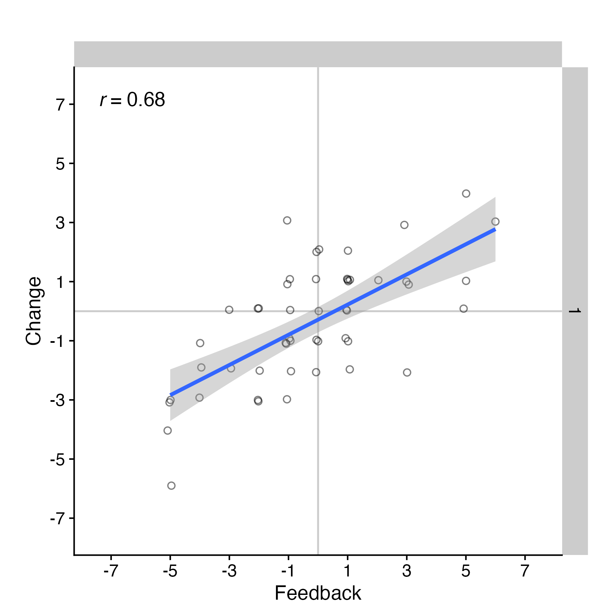

#### Scenario distributions, PBA

The three scenarios produce clearly different second-rating distributions. Self-Focused agents (blue) stay close to their original ratings. Balanced agents (red) shift toward the group. Socially-Influenced agents (green) pull strongly toward the group distribution, compressing into the mid-to-low range.

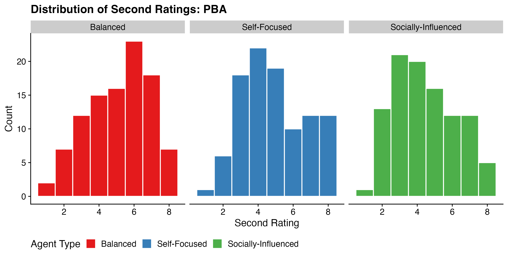

#### Scenario distributions, WBA

WBA shows the same pattern. Because `kappa` scales total evidence, the Balanced WBA agent (`own=1.0, ext=1.0`) accumulates twice as much evidence as its PBA counterpart, giving slightly tighter distributions.

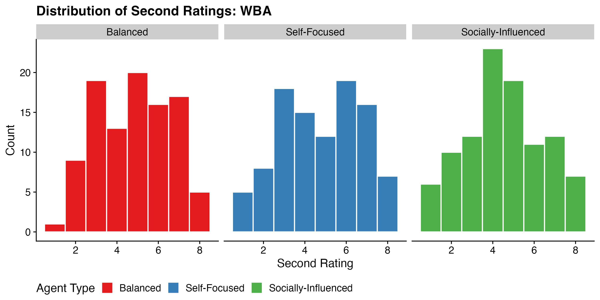

---

### Model Recovery

To check whether PBA and WBA are distinguishable, both models were fit to data generated by each of the six scenarios (3 per model, 50 simulations each). Model comparison used LOO-CV stacking weights.

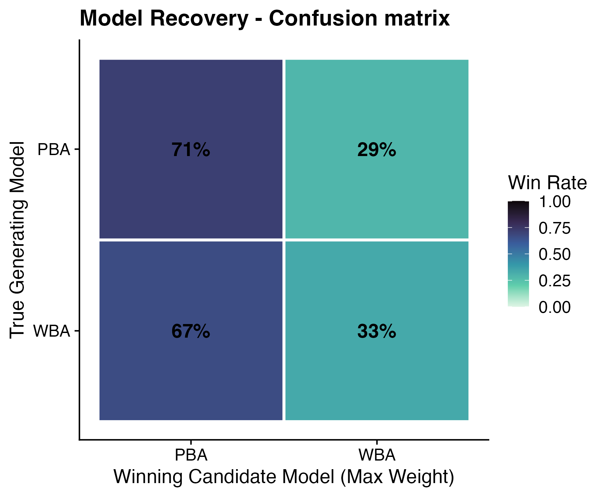

Recovery is poor. PBA is correctly identified 71% of the time. WBA is only correctly identified 33% of the time, and most WBA-generated datasets get attributed to PBA. At N=100 observations, the two models are hard to tell apart. PBA can mimic WBA well enough because the zero-sum constraint rarely causes problems when WBA parameters fall in a typical range. More data, or stimuli designed to push `kappa` to extreme values, would help.

---

### Sampling Diagnostics

These trace plots come from the last simulation fit in the recovery loop, used as a quick sanity check on sampler behaviour.

**PBA, parameter `p`:** Both chains mix well across the full run. No sign of pathological geometry.

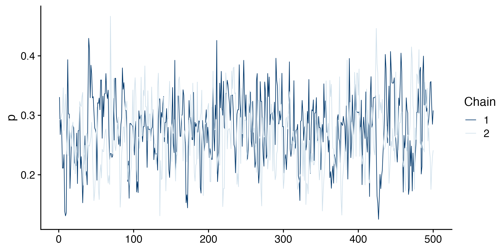

**WBA, parameters `rho` and `kappa`:** `rho` mixes fine. `kappa` occasionally makes large jumps, which follows from its long-tailed LogNormal prior. This does not cause divergences in the post-warmup draws.

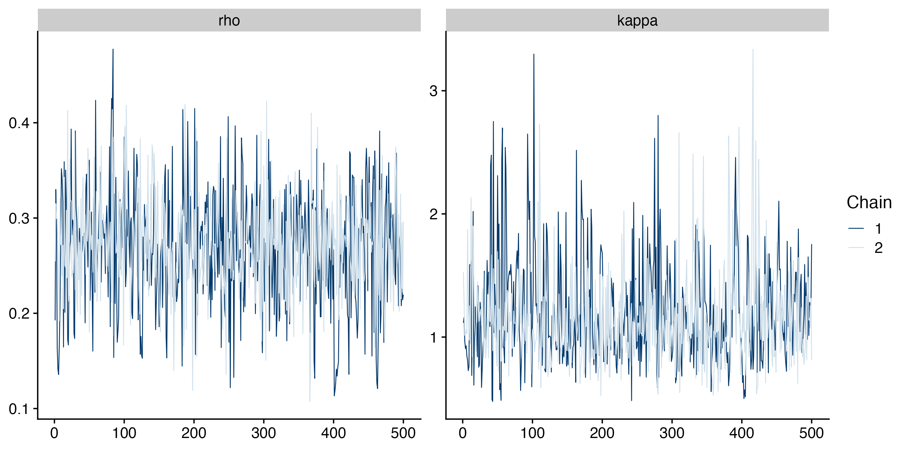

During warmup, WBA sometimes warns that `external_weighting` is NaN. This happens when `kappa` gets very close to 0. It resolves on its own and does not affect the final samples. Divergence counts are printed in the workbook after each fit.

---

### Empirical Data

The empirical dataset (`cogsci_clean.csv`) comes from cogsci's rating facial attractiveness rating study pre corona pandemic. Five participants are fit individually (no pooling), each having rated roughly 60 faces with group feedback between rounds.

#### Data exploration

The arrow plot shows each participant's ratings. Black dots are first ratings, arrowheads point to second ratings, and red dots mark the group rating. Most participants shift consistently toward the group, though the size of the shift varies.

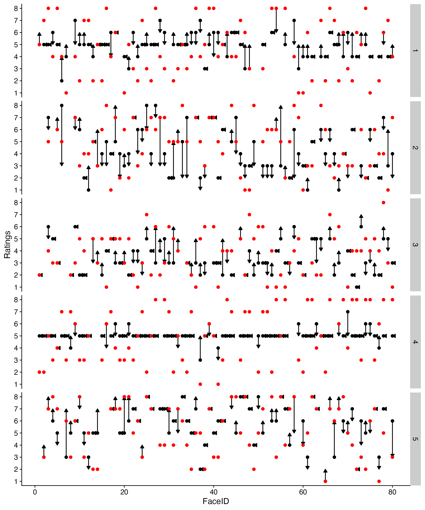

---

### Predictive Checks

#### Prior predictive checks

Under the prior, both models generate weakly positive feedback-change correlations (r around 0.23-0.38 for most participants). Participant 4 shows near-zero conformity in their data, and the prior already covers that, so the priors are not over-committed to any particular updating pattern.

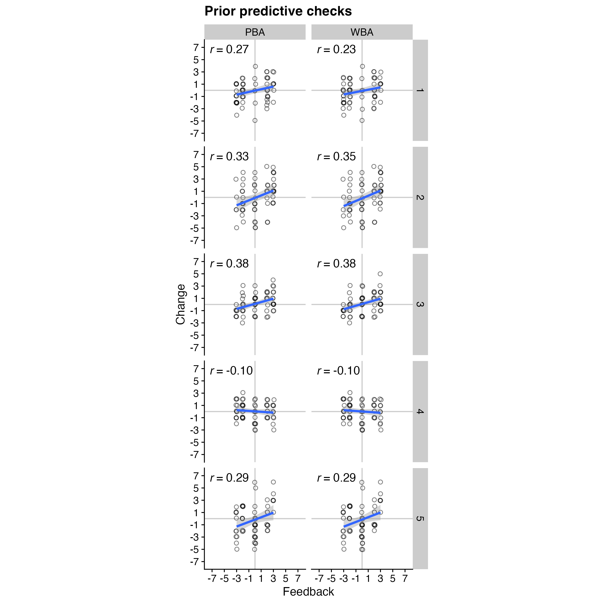

#### Posterior predictive checks

After fitting, the correlations get closer to the data for most participants. But neither model fully captures the steepest conformity effects. Predicted correlations stay a bit lower than observed for participants who conform strongly. Both models underestimate how much those participants move toward the group.

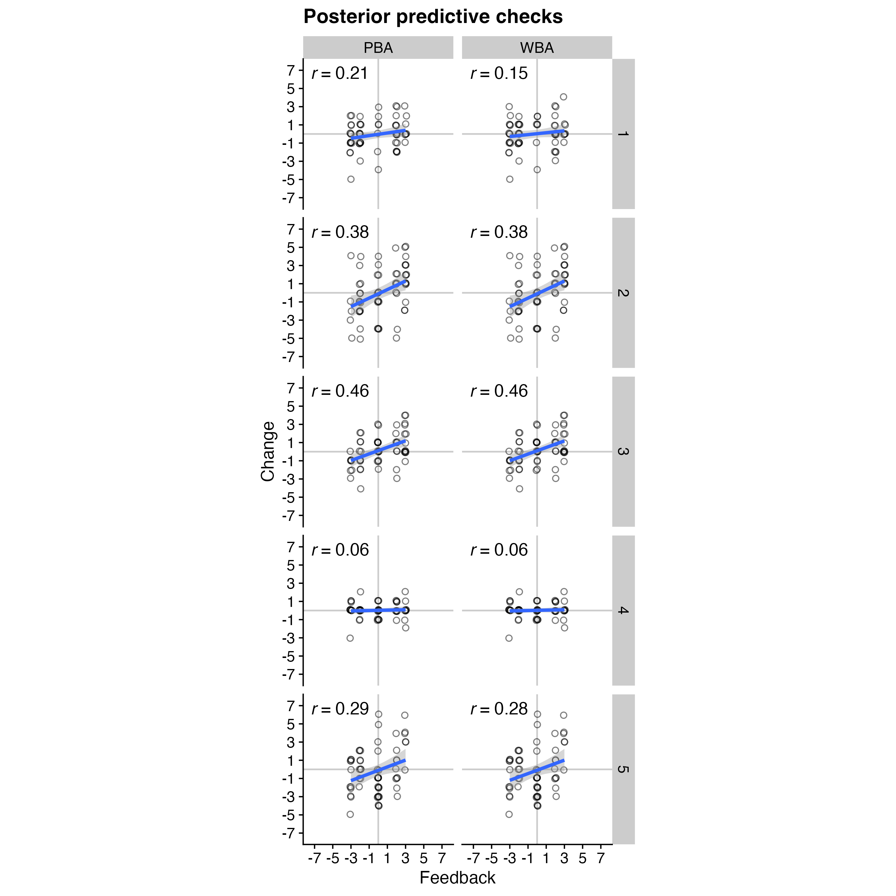

---

### Prior-Posterior Updates

In all five participants, the posterior is clearly narrower and shifted from the prior, confirming the data are informative.

#### PBA, parameter `p`

All participants end up with posterior mass between 0.7 and 0.9. They weight their own first rating roughly 3-4x more than the group. The Beta(2,2) prior is clearly and consistently updated.

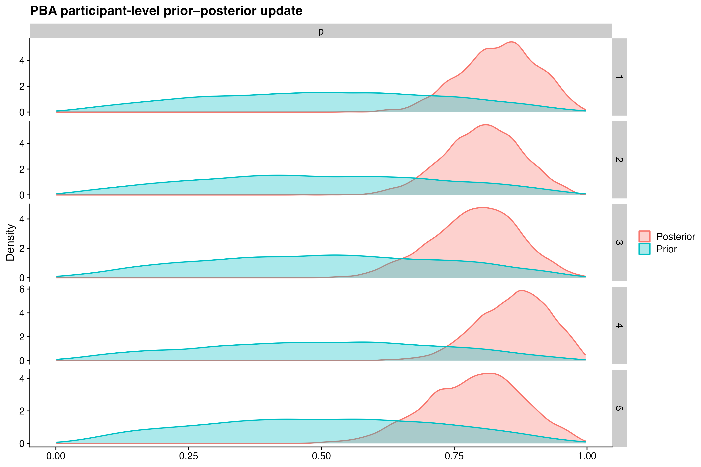

#### WBA, parameters `rho` and `kappa`

`rho` posteriors concentrate at 0.75-0.90, consistent with the PBA finding. `kappa` is pulled from its broad LogNormal prior toward low values (1-4), suggesting participants treat the group feedback as providing limited evidence rather than a strong signal to fully update on.

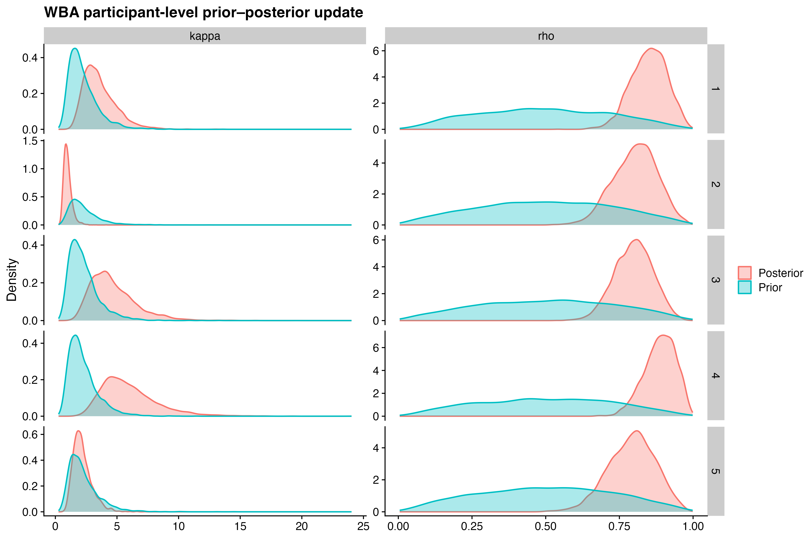

---

### Model Comparison

Both models are compared per participant using LOO-CV stacking weights, computed during the empirical fitting loop and accessible in the `fits` object in the workbook. Both models recover similar self-weighting estimates (around 0.75-0.85), produce nearly identical posterior predictive performance, and model recovery already showed they are hard to tell apart at N=100. Stacking weights end up close to 50/50 for most participants. Given that, PBA is the practical choice. It has one parameter instead of two, and the data do not justify the extra complexity of WBA.
